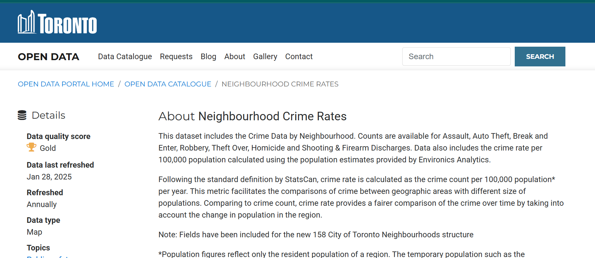
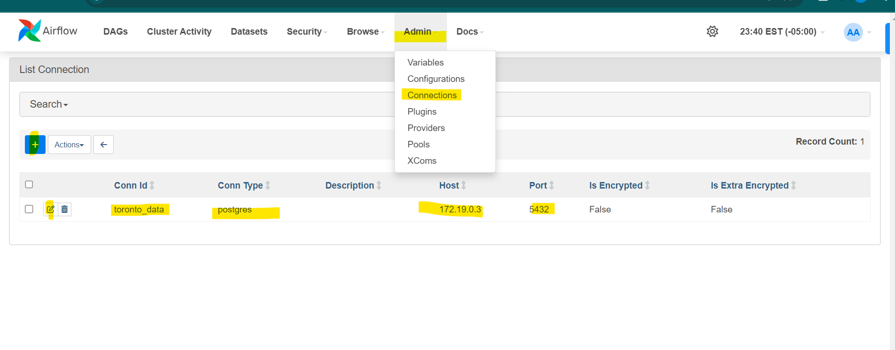
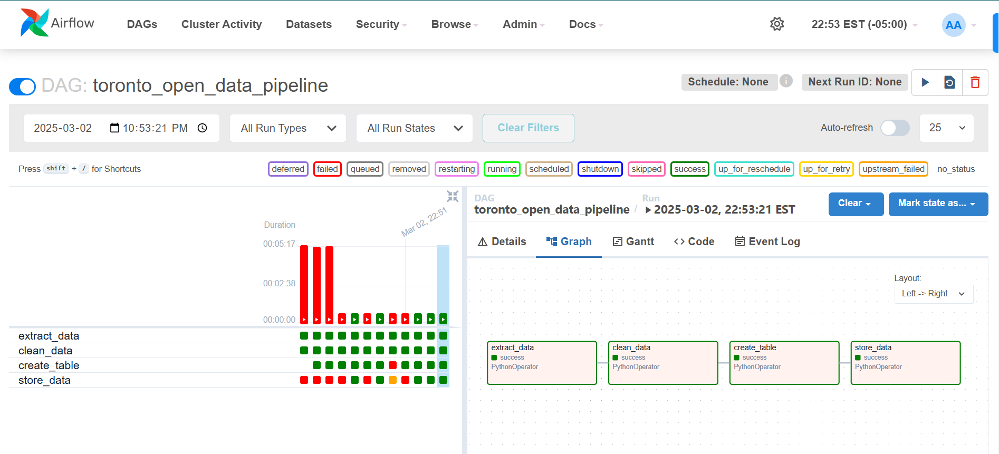
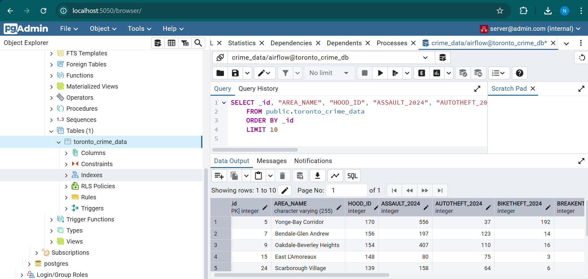

# toronto-crimedata-airflow-pipeline
I’ve built an ETL pipeline to extract crime data from the Toronto Neighbourhood Crime Rates dataset on open.toronto.ca and analyze it using PostgreSQL.

data source : https://open.toronto.ca/dataset/neighbourhood-crime-rates/



# Project Overview
This project automates the process of pulling crime data, transforming it as needed, and loading it into a PostgreSQL database. It’s powered by Apache Airflow for managing the pipeline workflows.

Here’s a quick guide on how to get this running and how the pipeline is set up.

# Prerequisites
- Docker installed
- Python 3.7+
- Basic knowledge of Git, Airflow, and PostgreSQL

# Step 1: Set Up Your Virtual Environment

```
python -m venv venv
venv/Scripts/Activate
pip install apache-airflow pandas requests psycopg2
pip install apache-airflow-providers-postgres

```

# Step 2: Initialize Git Repository

Create a git repository and make sure add .gitignore file to add all the files which are not required to push to  git repo

```
git init
```

```
echo "venv/
__pycache__/
airflow.cfg
logs/
.env" > .gitignore
```

```
git remote add origin https://github.com/YOUR_USERNAME/toronto-crime-pipeline.git
git add .
git commit -m "Initial commit"
git branch -M main
git push -u origin main
```

If you’d like to start from my repo, simply clone it with, although i dont prefer this as i havent uplaoded confidential data :

```
git clone https://github.com/Abhisheknakka/toronto-crimedata-airflow-pipeline
```


# Step 3: Set Up Airflow, PostgreSQL, and Docker

Head over to [Running airflow on docker](https://airflow.apache.org/docs/apache-airflow/stable/howto/docker-compose/index.html)

scroll to curl command copy andd paste on gitbash in VS code
```
curl -LfO 'https://airflow.apache.org/docs/apache-airflow/2.10.5/docker-compose.yaml'
```

Now you will see a docker yaml file generated.

get back to gitbash and copy below commands one by one

```
mkdir -p ./dags ./logs ./plugins ./config
echo -e "AIRFLOW_UID=$(id -u)" > .env
```

next
```
AIRFLOW_UID=50000
```

next make sure docker is installed and open

```
docker compose up airflow-init
```


Next go to chrome and type ```http://localhost:8080```

user id and password both "airflow"


now login and time to setup next big thing

# Step 4: Setting Up PostgreSQL Database in Docker

1. go to docker-compose.yaml  file

added port for postgres 5432 and 

```
  pgadmin:
    container_name: my_toronto_pgadmin_server
    image: dpage/pgadmin4
    restart: always
    environment:
      PGADMIN_DEFAULT_EMAIL : server@admin.com
      PGADMIN_DEFAULT_PASSWORD : root
    ports:
      - "5050:80"
```

checkout my docker-compose.yaml file for more details


after pasting this, do 

```docker compose down```
and then 
```docker compose up```


you will be able to login to pgadmin.
```localhost:5050````

You can now log in to pgAdmin via http://localhost:5050.

Username: server@admin.com
Password: root

After logging in, create a new server connection and add your PostgreSQL details.


# Step 5: Connect Airflow to PostgreSQL
In Airflow, navigate to Admin > Connections and add the PostgreSQL connection details with the correct name as specified in your script.


make sure to add the connection  name in script correctly


# Results
Once everything is set up, you’ll see the output of your ETL pipeline in Airflow's UI. Here’s a look at the results:

DAG Output:


Postgres



# Conclusion
With Airflow, Docker, and PostgreSQL, you can automate the process of extracting, transforming, and loading (ETL) data seamlessly. The power of Apache Airflow lies in its scalability, flexibility, and observability—making it the perfect tool for handling complex data workflows.

Feel free to clone the repository and try it out for yourself!

# My key learnings / observations while debugging errors

1. Error 1: Undefined Column Error (column "area_name" does not exist)
Cause:
The column AREA_NAME in your SQL query does not match the column name in the database, either in terms of case sensitivity or exact spelling.

Solution:
Ensure that the column names in the SQL query match exactly with those in the database schema. In PostgreSQL, column names are case-sensitive if enclosed in quotes (" "). To ensure consistency, create the table with column names in uppercase (or lowercase, if preferred) and use the exact case when writing queries.

2. Error 2: Duplicate Key Error while running DAGs multiple times (duplicate key value violates unique constraint)
Cause:
You are trying to insert a record with a duplicate _id value. The _id column is the primary key in your table, so it must be unique.

Solution:

Skip duplicate records: You can use the ON CONFLICT clause in PostgreSQL to skip inserting duplicate values.

3. Error: Table Does Not Exist (relation "toronto_crime_data" does not exist)

Cause:
The error occurs when you try to execute an INSERT query or any other SQL operation (like SELECT, UPDATE, etc.) on a table that does not exist in the database. This usually happens when:

Solution: 

CREATE TABLE IF NOT EXISTS toronto_crime_data ()