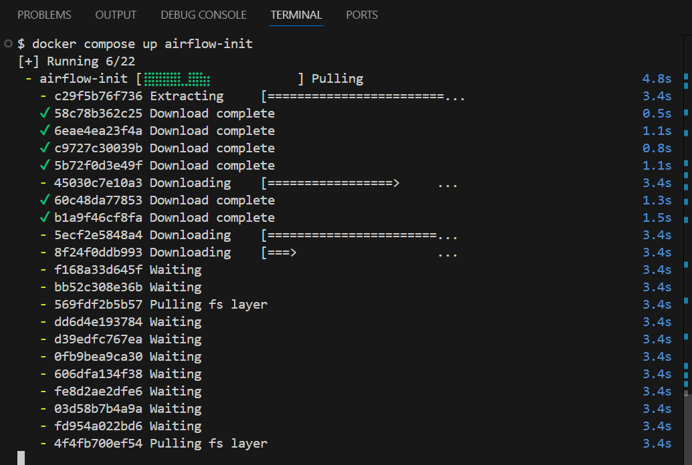

# toronto-crimedata-airflow-pipeline
This is a etl pipeline built to extract crime data from open.toronto.ca site and perform analysis on postgres 


pre requisites: docker installed
step 1: create a virtual environment and install necessary libraries

```
python -m venv venv
venv/Scripts/Activate
pip install apache-airflow pandas requests psycopg2
```

step 2: Initialize git

Create a git repository and make sure add .gitignore file to add all the files which are not required to push to  git repo

```
git init
```

```
echo "venv/
__pycache__/
airflow.cfg
logs/
dags/
.env" > .gitignore
```

```
git remote add origin https://github.com/YOUR_USERNAME/toronto-crime-pipeline.git
git add .
git commit -m "Initial commit"
git branch -M main
git push -u origin main
```

if someone who wants to start from my repo, then just clone my repository 

```
git clone https://github.com/Abhisheknakka/toronto-crimedata-airflow-pipeline
```


Step 3: Set Up Airflow, PostgreSQL, and Docker

Head over to [Running airflow on docker](https://airflow.apache.org/docs/apache-airflow/stable/howto/docker-compose/index.html)

scroll to curl command copy andd paste on gitbash in VS code
```
curl -LfO 'https://airflow.apache.org/docs/apache-airflow/2.10.5/docker-compose.yaml'
```

Now you will see a docker yaml file generated.

get back to gitbash and copy below commands one by one

```
mkdir -p ./dags ./logs ./plugins ./config
echo -e "AIRFLOW_UID=$(id -u)" > .env
```

next
```
AIRFLOW_UID=50000
```

next make sure docker is installed and open

```
docker compose up airflow-init
```



Next go to chrome and type ```http://localhost:8080```

user id and password both "airflow"


now login and time to setup next big thing

Step 4: Setting up database POSTGRES on docker

1. go to docker-compose.yaml  file

added port for postgres 5432 and 

```
  pgadmin:
    container_name: my_toronto_pgadmin_server
    image: dpage/pgadmin4
    restart: always
    environment:
      PGADMIN_DEFAULT_EMAIL : server@admin.com
      PGADMIN_DEFAULT_PASSWORD : root
    ports:
      - "5050:80"
```

checkout my docker-compose.yaml file for more details


after pasting this, do 

```docker compose down```
and then 
```docker compose up```


you will be able to login to pgadmin.
```localhost:5432````